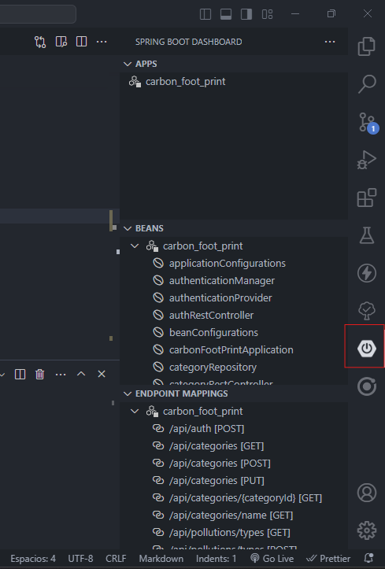
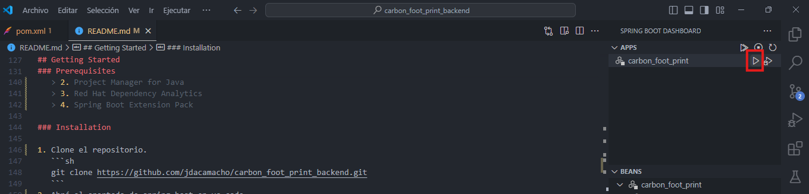

<!-- Improved compatibility of back to top link: See: https://github.com/othneildrew/Best-README-Template/pull/73 -->

<a name="readme-top"></a>

<!--
*** Thanks for checking out the Best-README-Template. If you have a suggestion
*** that would make this better, please fork the repo and create a pull request
*** or simply open an issue with the tag "enhancement".
*** Don't forget to give the project a star!
*** Thanks again! Now go create something AMAZING! :D
-->

<!-- PROJECT SHIELDS -->
<!--
*** I'm using markdown "reference style" links for readability.
*** Reference links are enclosed in brackets [ ] instead of parentheses ( ).
*** See the bottom of this document for the declaration of the reference variables
*** for contributors-url, forks-url, etc. This is an optional, concise syntax you may use.
*** https://www.markdownguide.org/basic-syntax/#reference-style-links
-->

[![Contributors][contributors-shield]][contributors-url]
[![Forks][forks-shield]][forks-url]
[![Stargazers][stars-shield]][stars-url]
[![Issues][issues-shield]][issues-url]
[![MIT License][license-shield]][license-url]
[![LinkedIn][linkedin-shield]][linkedin-url]

<!-- PROJECT LOGO -->
<br />
<div align="center">
  <a href="https://github.com/jdacamacho/carbon_foot_print_backend">
    
  </a>

<h3 align="center">Cruz Roja Carbon FootPrint</h3>

  <p align="center">
    Desarrollo API-Rest, con arquitetura hexagonal el cual proveerán servicios de administración, calculo de huella de carbono, gestión de planes de compensación, estadísticas propias para empresas y cruz roja y generación de informes en ciertas áreas.
    <br />
    <a href="https://github.com/jdacamacho/carbon_foot_print_backend"><strong>Explore the docs »</strong></a>
    <br />
    <br />
    <a href="https://github.com/jdacamacho/carbon_foot_print_backend">View Demo</a>
    ·
    <a href="https://github.com/jdacamacho/carbon_foot_print_backend/issues/new?labels=bug&template=bug-report---.md">Report Bug</a>
    ·
    <a href="https://github.com/jdacamacho/carbon_foot_print_backend/issues/new?labels=enhancement&template=feature-request---.md">Request Feature</a>
  </p>
</div>

<!-- TABLE OF CONTENTS -->
<details>
  <summary>Table of Contents</summary>
  <ol>
    <li>
      <a href="#about-the-project">About The Project</a>
      <ul>
        <li><a href="#built-with">Built With</a></li>
      </ul>
    </li>
    <li>
      <a href="#getting-started">Getting Started</a>
      <ul>
        <li><a href="#prerequisites">Prerequisites</a></li>
        <li><a href="#installation">Installation</a></li>
      </ul>
    </li>
    <li><a href="#usage">Usage</a></li>
    <li><a href="#roadmap">Roadmap</a></li>
    <li><a href="#contributing">Contributing</a></li>
    <li><a href="#license">License</a></li>
    <li><a href="#contact">Contact</a></li>
    <li><a href="#acknowledgments">Acknowledgments</a></li>
  </ol>
</details>

<!-- ABOUT THE PROJECT -->

## About The Project

```bash

src\
└main\
 ├─java\com\cruzroja\carbon_foot_print\
 │├─Application\
 ││├─Input\
 ││└─Output\
 │├─Domain\
 ││├─Models\
 ││└─UserCases\
 │└─Infraestructure\
 │ ├─Configuration\
 │ ├─Input\
 │ ├─JWT\
 │ └─Output\
 │
 ├─resources\

```

La arquitectura empleada para este proyecto es la hexagonal, debido a la adaptabilidad que esta presenta ante cambios de tecnologías, dependiendo exclusivamente de las interfaces definidas como puertos (port) o puertas de salida (gateway).
El sistema busca abordar una oportunidad de negocio o servicio que puede llegar a prestar la cruz roja cauca. Ya que debido al avace que se esta haciendo actualmente en conciencia ecológica en el país es importante, se espera que en un futuro cercano las empresas deban empezar a compensar la huella de carbono que emitn por sus procesos.
Se tiene como objetivo desarrollar un mvp bajo el modelo API-Restfull de forma que se provean diferentes servicios administrativos con el fin de establecer:
a. Compañías, Usuarios administrativos, Voluntarios.
b. Configuración de calculadora: Fuentes Contaminantes, tipos de contaminantes, categorías de contaminantes y perfiles de empresa.
c. Configuración de planes de acción: Actividades individuales, paquetes de actividades de 1 solo tipo, conjunto de actividades (diferentes actividades).
d. Gestión de planes de acción contratados: Historial de actividades realizadas, programación de actividades, informes.
e. Estadísticas: Generación de huella de carbono en el tiempo, progreso de compensación, tipos de contaminantes que más huella de carbono han generado, etc.

> [!WARNING]
> Como aclaración se tiene hacer que el proyecto va enfocado a la producción de gases de efecto invernadero por lo que puede que muchos tipos de contaminación no se tengan encuenta, la información de huella de carbono se obtiene de diferentes estudios encontrados en el internet, se le sugiere buscar estudios de fuentes confiables que provean la información con la cuál se va a "alimentar" el sistema.

<p align="right">(<a href="#readme-top">back to top</a>)</p>

### Built With

- [![SpringBoot][SpringBoot-shield]][SpringBoot-link]
- [![MySql][MySql-shield]][MySql-link]
- [![Java][Java-shield]][Java-link]

<p align="right">(<a href="#readme-top">back to top</a>)</p>

<!-- GETTING STARTED -->

## Getting Started

A continuación se realizará un instructivo de cómo se deberá realizar la instalación para correr el proyecto.

### Prerequisites

1. Instalar java jDK 17 [![Java][Java-shield]][Java-link]
2. Instalar un gestor de bases de datos MySQL, en nuestro caso usamos workbench [![MySQL][MySQL-shield]][MySQL-link]
3. Asegurese de tener las herramientas necesatias en su editor de código.

> [!NOTE]
> El proyecto se desarrollo en el editor de código VS Code dónde se utilizaron las siguientes extenciones
>
> 1. Language Support for Java(TM) by Red Hat
> 2. Project Manager for Java
> 3. Red Hat Dependency Analytics
> 4. Spring Boot Extension Pack

### Installation

1. Clone el repositorio.
   ```sh
   git clone https://github.com/jdacamacho/carbon_foot_print_backend.git
   ```
2. Cree la base de datos

   ```sh
   mysql -u root -p
       create schema dbcruzroja
   ```

> [!NOTE]
> La información del schema, usuario y contraseña deben ir en el application.properties o crear un archivo de variables de entorno. 3. Abrá el apartado de spring boot en vs code

<div align="left">
    
</div>
4. Ejecute el proyecto desde vs code
<div align="left">
    
</div>
5. Finalmente abra su gestor de peticiones (postman, thunder, etc).
6. La información de inicio de sesión para la generación del token se encuentra en resources/import.sql

<p align="right">(<a href="#readme-top">back to top</a>)</p>

<!-- USAGE EXAMPLES -->

## Usage

La información de los endpoints se obtiene en la ruta (http://localhost:5000/swagger-ui/index.html) una vez lanzado el proyecto.

<p align="right">(<a href="#readme-top">back to top</a>)</p>

<!-- ROADMAP -->

## Roadmap

- [Administración] Feature 1
- [Calculadora] Feature 2
- [Gestion de planes de compensación] Feature 3
- [Estadísticas] Feature 4

See the [open issues](https://github.com/jdacamacho/carbon_foot_print_backend/issues) for a full list of proposed features (and known issues).

<p align="right">(<a href="#readme-top">back to top</a>)</p>

<!-- CONTRIBUTING -->

## Contributing

Contributions are what make the open source community such an amazing place to learn, inspire, and create. Any contributions you make are **greatly appreciated**.

If you have a suggestion that would make this better, please fork the repo and create a pull request. You can also simply open an issue with the tag "enhancement".
Don't forget to give the project a star! Thanks again!

1. Fork the Project
2. Create your Feature Branch (`git checkout -b feature/AmazingFeature`)
3. Commit your Changes (`git commit -m 'Add some AmazingFeature'`)
4. Push to the Branch (`git push origin feature/AmazingFeature`)
5. Open a Pull Request

<p align="right">(<a href="#readme-top">back to top</a>)</p>

<!-- LICENSE -->

## License

Distributed under the MIT License. See `LICENSE.txt` for more information.

<p align="right">(<a href="#readme-top">back to top</a>)</p>

<!-- CONTACT -->

## Contact

Project Link: [https://github.com/jdacamacho/carbon_foot_print_backend](https://github.com/jdacamacho/carbon_foot_print_backend)

<p align="right">(<a href="#readme-top">back to top</a>)</p>

<!-- MARKDOWN LINKS & IMAGES -->
<!-- https://www.markdownguide.org/basic-syntax/#reference-style-links -->

[contributors-shield]: https://img.shields.io/github/contributors/jdacamacho/carbon_foot_print_backend.svg?style=for-the-badge
[contributors-url]: https://github.com/jdacamacho/carbon_foot_print_backend/graphs/contributors
[forks-shield]: https://img.shields.io/github/forks/jdacamacho/carbon_foot_print_backend.svg?style=for-the-badge
[forks-url]: https://github.com/jdacamacho/carbon_foot_print_backend/network/members
[stars-shield]: https://img.shields.io/github/stars/jdacamacho/carbon_foot_print_backend.svg?style=for-the-badge
[stars-url]: https://github.com/jdacamacho/carbon_foot_print_backend/stargazers
[issues-shield]: https://img.shields.io/github/issues/jdacamacho/carbon_foot_print_backend.svg?style=for-the-badge
[issues-url]: https://github.com/jdacamacho/carbon_foot_print_backend/issues
[license-shield]: https://img.shields.io/github/license/jdacamacho/carbon_foot_print_backend.svg?style=for-the-badge
[license-url]: https://github.com/jdacamacho/carbon_foot_print_backend/blob/master/LICENSE.txt
[linkedin-shield]: https://img.shields.io/badge/-LinkedIn-black.svg?style=for-the-badge&logo=linkedin&colorB=555
[linkedin-url]: https://linkedin.com/in/linkedin_username
[product-screenshot]: images/screenshot.png
[Next.js]: https://img.shields.io/badge/next.js-000000?style=for-the-badge&logo=nextdotjs&logoColor=white
[Next-url]: https://nextjs.org/
[React.js]: https://img.shields.io/badge/React-20232A?style=for-the-badge&logo=react&logoColor=61DAFB
[React-url]: https://reactjs.org/
[Vue.js]: https://img.shields.io/badge/Vue.js-35495E?style=for-the-badge&logo=vuedotjs&logoColor=4FC08D
[Vue-url]: https://vuejs.org/
[Angular.io]: https://img.shields.io/badge/Angular-DD0031?style=for-the-badge&logo=angular&logoColor=white
[Angular-url]: https://angular.io/
[Svelte.dev]: https://img.shields.io/badge/Svelte-4A4A55?style=for-the-badge&logo=svelte&logoColor=FF3E00
[Svelte-url]: https://svelte.dev/
[Laravel.com]: https://img.shields.io/badge/Laravel-FF2D20?style=for-the-badge&logo=laravel&logoColor=white
[Laravel-url]: https://laravel.com
[Bootstrap.com]: https://img.shields.io/badge/Bootstrap-563D7C?style=for-the-badge&logo=bootstrap&logoColor=white
[Bootstrap-url]: https://getbootstrap.com
[JQuery.com]: https://img.shields.io/badge/jQuery-0769AD?style=for-the-badge&logo=jquery&logoColor=white
[JQuery-url]: https://jquery.com
[SpringBoot-shield]: https://img.shields.io/badge/SpringBoot-6DB33F?style=flat-square&logo=Spring&logoColor=white
[SpringBoot-link]: https://spring.io/projects/spring-boot
[MySQL-shield]: https://shields.io/badge/MySQL-lightgrey?logo=mysql&style=plastic&logoColor=white&labelColor=blue
[MySQL-link]: https://www.mysql.com/products/workbench/
[Java-shield]: https://img.shields.io/badge/Java-ED8B00?style=for-the-badge&logo=openjdk&logoColor=white
[Java-link]: https://www.oracle.com/java/technologies/javase/jdk17-archive-downloads.html
